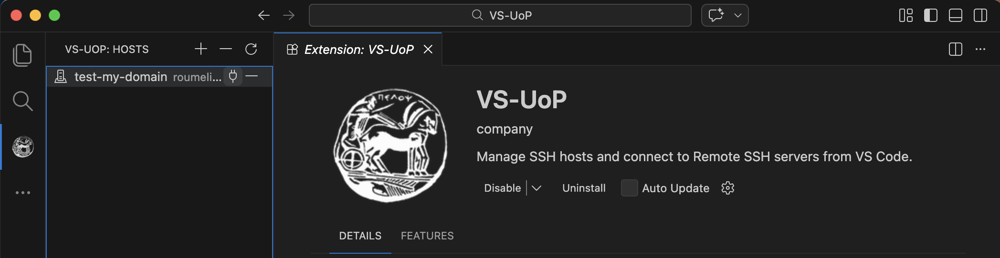

# VS-UoP: Visual Studio Code Extension



VS-UoP is a TypeScript-based Visual Studio Code extension that centralizes SSH host management and streamlines connection to University of Peloponnese servers via Remote SSH.

## Features

- Custom Activity Bar container with dedicated sidebar view.
- TreeView listing managed SSH hosts.
- `+` command to add hosts (FQDN/IP + username + alias).
- `-` command to remove hosts from both extension storage and `~/.ssh/config`.
- Connect action per host.
- Integration-friendly flow with Remote SSH (`ms-vscode-remote.remote-ssh`).

## Installation

### Prerequisites

- VS Code `1.95.0+`
- OpenSSH client available on local machine (`ssh` / `ssh.exe`)
- Recommended VS Code extensions:
  - Remote - SSH (`ms-vscode-remote.remote-ssh`)

### Quick Installation (.vsix)

1. Open VS Code.
2. Open the **Extensions** view from the left sidebar.
3. Search for and install **VSIX Manager**.
4. Open the Command Palette (`Cmd+Shift+P` on macOS / `Ctrl+Shift+P` on Windows/Linux).
5. Run `Extensions: Install from VSIX...`.
6. Select `vs-uop-0.1.0.vsix` and click **Install**.
7. After installation, locate the **VS-UoP** icon in the left Activity Bar.
8. Click it to open the hosts list, then use `+` to add a host or `-` to remove a host.

## Usage

1. Open the **VS-UoP** icon in Activity Bar.
2. Click **Add Host** (`+`) and provide:
   - Hostname / IP (e.g. `test.domain.gr`)
   - SSH username (e.g. `a_username`)
   - Alias (default generated from hostname)
3. Click a host (or inline connect action) to open a Remote SSH window.
4. Enter password (if requested) in the standard Remote SSH flow.
5. Click **Remove Host** (`-`) to delete an entry from extension storage and SSH config.

### For Contributors Only: Build from source

The sections below are intended for users who want to contribute to this repository.

1. Clone repository.
2. Install dependencies:

   ```bash
   npm install
   ```

3. Compile:

   ```bash
   npm run compile
   ```

4. Build a shareable VSIX package (one-command packaging step):

  ```bash
  npm run compile && npx @vscode/vsce package --allow-missing-repository
  ```

   If `node_modules` is missing (or you get `tsc: command not found`), use:

   ```bash
   npm install && npm run compile && npx @vscode/vsce package --allow-missing-repository
   ```

5. Press `F5` in VS Code to launch the Extension Development Host.

## SSH Config Behavior

When a host is added or updated, the extension writes a block to `~/.ssh/config`:

```ssh-config
Host test
    HostName test.domain.gr
    User a_username
    IdentityFile ~/.ssh/id_ed25519
```

If a matching `Host <alias>` block exists, it is replaced.

## Architecture Overview

```text
src/
  extension.ts                     # Activation and command wiring
  models/
    host.ts                        # Host metadata model
  services/
    hostStorage.ts                 # globalState persistence
    sshConfigManager.ts            # ~/.ssh/config read/update/remove
    remoteBootstrapService.ts      # Remote SSH window open/handoff
  ui/
    hostTreeProvider.ts            # Sidebar TreeDataProvider
media/
  icon.png                # Activity Bar icon
```

### Separation of concerns

- **UI layer**: TreeView and user interactions.
- **Storage layer**: host metadata persistence (`globalState`).
- **SSH config layer**: deterministic host block management.
- **Connection layer**: opens remote windows through Remote SSH.

## Development Setup

```bash
npm install
npm run lint
npm run compile
```

Use VS Code command **Run Extension** (`F5`) for local testing.

## Configuration

- `gpuSshManager.defaultIdentityFile` (default: `~/.ssh/id_ed25519`)


## Security Considerations

- The extension modifies `~/.ssh/config`; review resulting entries.
- Password authentication is delegated to the SSH client / VS Code Remote SSH flow.
- No credentials are persisted by the extension.
- Enforce least-privilege SSH accounts for production servers.

## Future Improvements

- Automatic initialization and configuration of each user's own Python environment after remote connection.
- Per-host custom key path and port configuration UI.
- Health check indicators in TreeView.
